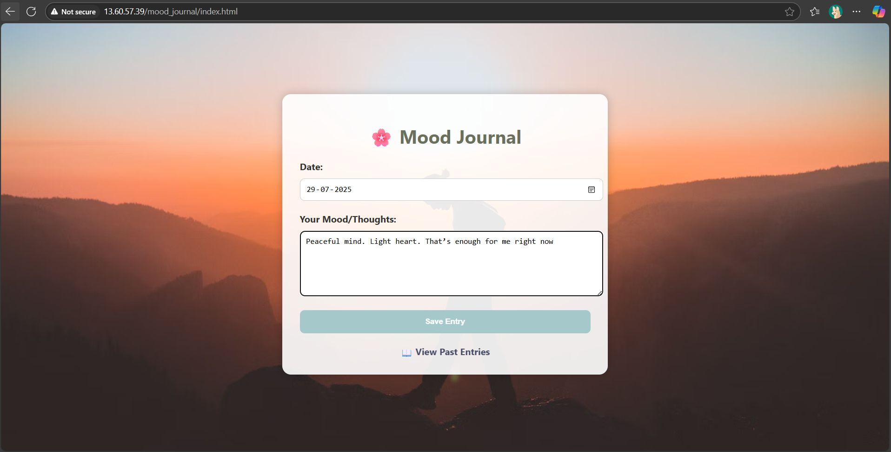
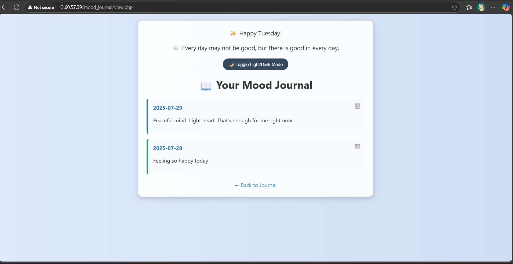
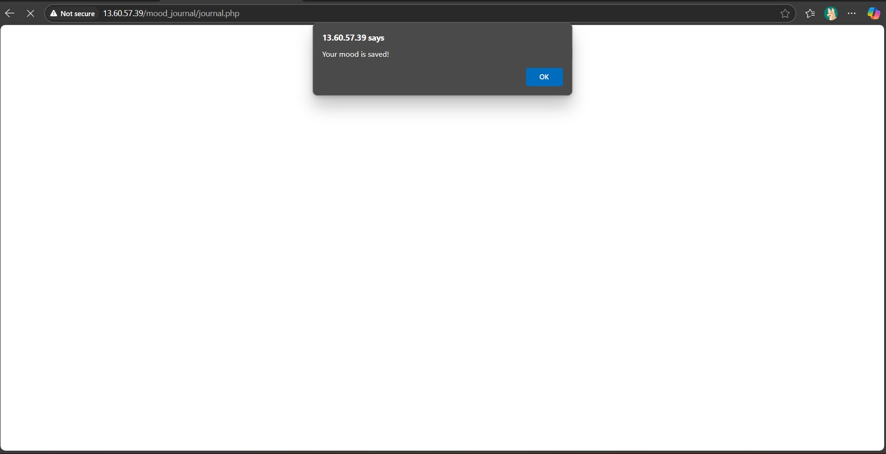
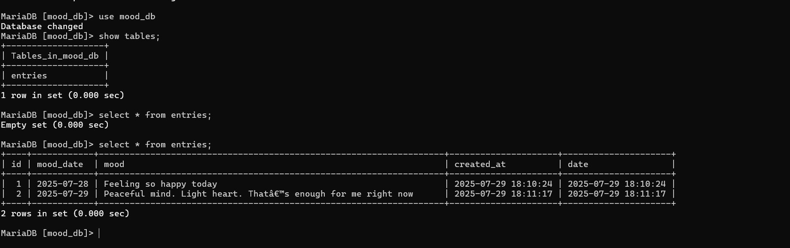

# mood-journa
# 🌤️ Mood Journal

A simple and elegant **PHP + MySQL web app** that helps users record and reflect on their daily moods.  
You can write, view, and delete your mood entries — all stored securely in a MySQL database.

---

## 📁 Project Structure
mood-journal/
├── index.html # Main page to add mood entries
├── journal.php # Handles mood entry submission
├── view.php # Displays past mood entries
├── style.css # Styling for all pages
├── db.php # Database connection file
└── mood_db.sql # Database schema


---

## 🧠 Features

✨ **Add Mood Entries** – Record your daily thoughts and emotions  
🕊️ **View Past Entries** – See how your mood has evolved over time  
🗑️ **Delete Entries** – Remove old or unwanted notes  
🎨 **Responsive & Calm UI** – Soft gradient theme with a clean layout  
💾 **MySQL Backend** – Securely stores all your journal data  

---

## 🖥️ Tech Stack

| Category | Technology |
|-----------|-------------|
| **Frontend** | HTML5, CSS3 |
| **Backend** | PHP |
| **Database** | MySQL (MariaDB compatible) |
| **Server** | Apache (XAMPP / EC2 / LAMP Stack) |

---

## ⚙️ Setup Instructions

### 1️⃣ Clone this Repository
```bash
git clone https://github.com/<your-username>/mood-journal.git
cd mood-journal

2️⃣ Create Database

Open MySQL or phpMyAdmin and run:
SOURCE mood_db.sql;

3️⃣ Configure Database Connection

Edit db.php if needed:
$host = 'localhost';
$user = 'root';
$password = '';
$database = 'mood_db';

4️⃣ Start Apache & MySQL

If using XAMPP:

Start Apache & MySQL from the XAMPP control panel.

5️⃣ Run the App

Open your browser and go to:
http://localhost/mood-journal/index.html

🪄 Example Screenshots





🧑‍💻 Author

Nikita Thosare
💼 Cloud & DevOps Engineer 